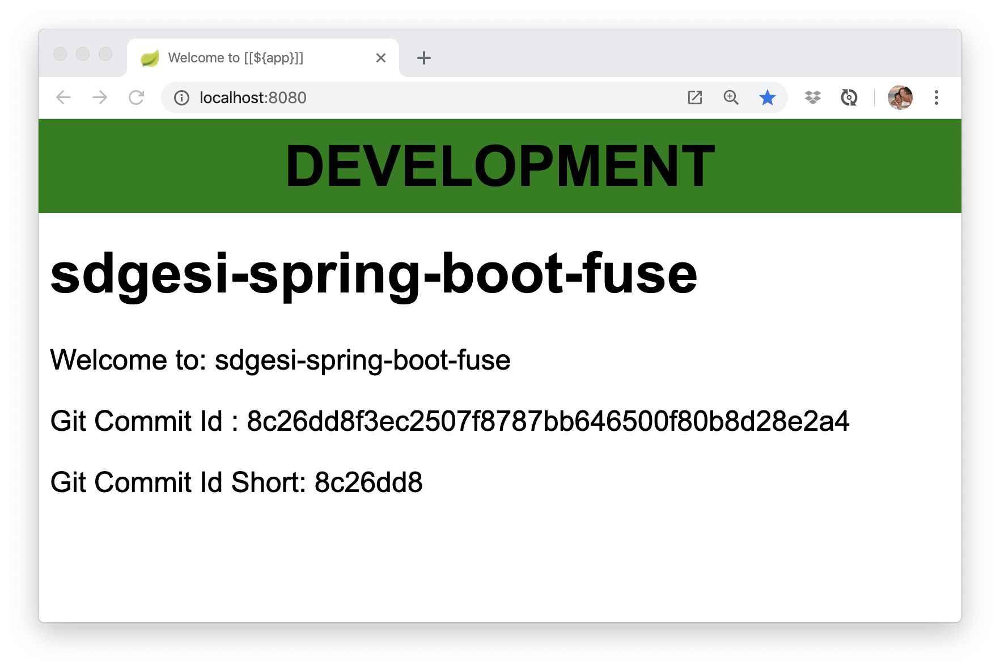

# SDGESI Spring Boot Fuse Application

This is an example application used to emulate real SDGESI Fuse Services
for the purposes of testing out CI/CD pipelines for our team.  This simple
app will display an informational page at the home directory.  Properties
in the [application.properties](src/main/resources/application.properties) 
file will configuration of the page display, including the banner color, 
application name, as well as Git commit information.




## Building

The example can be built with

    mvn clean install

### Running the application standalone on your machine

You can also run this quickstart as a standalone project directly:

Obtain the project and enter the project's directory
Build the project:

```
$ mvn clean package
$ mvn spring-boot:run 
```

### Running on an OpenShift Cluster
